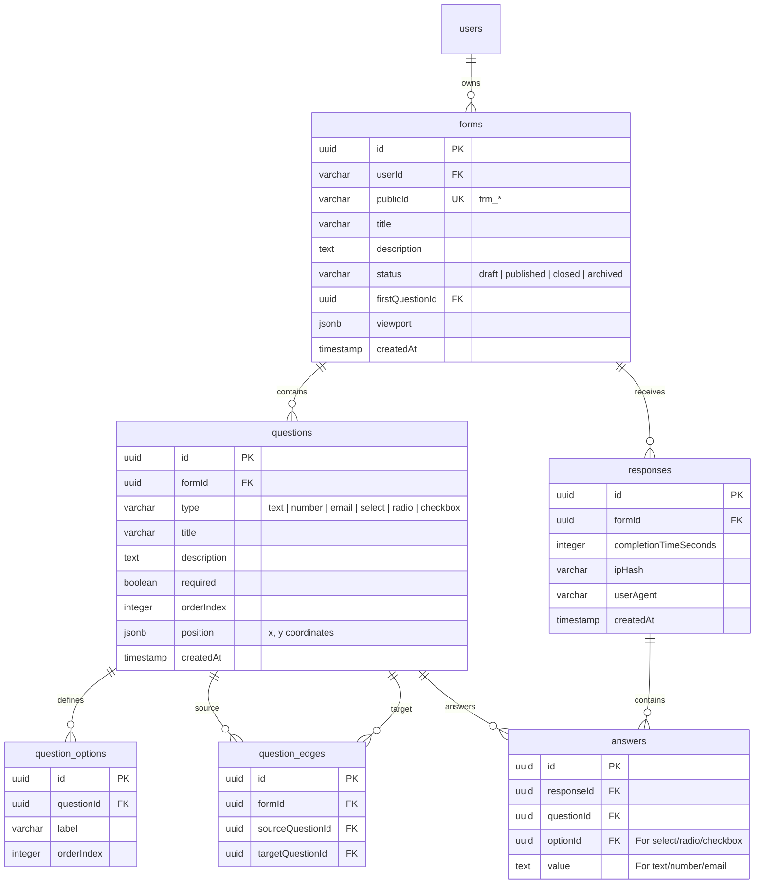

# Technical & Visual Design Document: Blueprint

**Project**: Blueprint (Portfolio-Grade Visual Form Builder)  
**Document Status**: Draft / System Blueprint  
**Target Architecture**: Monorepo (Next.js 16 + Express 5 + Drizzle / Neon PostgreSQL)  

---

## 1. Executive Summary & Vision

**Blueprint** is a portfolio-grade, node-graph visual form builder application. It enables authenticated form owners to visually compose, customize, and publish step-by-step forms using an interactive node canvas, distribute public form links, and analyze respondent submissions.

### Core User Journey
$$\text{Sign In} \longrightarrow \text{Dashboard} \longrightarrow \text{Create Form} \longrightarrow \text{Build on Canvas} \longrightarrow \text{Publish} \longrightarrow \text{Public Link (\texttt{frm\_*})} \longrightarrow \text{Submit} \longrightarrow \text{Review Responses}$$

### Product Vocabulary & Entities
- **Form (`forms`)**: The owner-managed root resource containing metadata (`title`, `description`, `status`, `publicId`).
- **Question (`questions`)**: A field node on the builder canvas (`text`, `number`, `email`, `select`, `radio`, `checkbox`).
- **Option (`question_options`)**: Standardized selectable choices associated with choice-based questions (`select`, `radio`, `checkbox`).
- **Builder Graph (`question_edges`)**: Persisted graph connections between questions representing flow direction. Validated as a connected linear path in MVP.
- **Public ID**: A shareable, non-UUID identifier starting with `frm_` used for public responder URLs (`/f/:publicId`).
- **Response (`responses`) / Answer (`answers`)**: Records of respondent submissions capturing completion time, hashed metadata, and individual question answers.

---

## 2. System Architecture & Component Design

The project uses a pnpm monorepo managed via Turborepo.

```
                    +-------------------------------------------------+
                    |                Next.js 16 Web App               |
                    |           (React 19, React Flow, Tailwind)      |
                    +------------------------+------------------------+
                                             |
                                  REST API / Cookies (Better Auth)
                                             |
                    +------------------------v------------------------+
                    |                Express 5 API App                |
                    |         (Pino Logger, Zod Validation)           |
                    +------------------------+------------------------+
                                             |
                             WebSocket Connection (Neon Serverless)
                                             |
                    +------------------------v------------------------+
                    |               Neon PostgreSQL DB                |
                    |                (Drizzle ORM)                    |
                    +------------------------+------------------------+
```

### Monorepo Structure
- `apps/web`: Next.js 16 App Router application. Uses React Flow and `@dnd-kit` for the node builder, TanStack Query for remote state management, and Tailwind CSS.
- `apps/api`: Express 5 server structured by domain modules (`forms`, `public-forms`, `health`).
- `packages/db`: Drizzle ORM schema, migrations, connection client (`neon-serverless` WebSocket driver for transaction support).
- `packages/validators`: Shared Zod validation schemas, domain types, and system contracts.
- `packages/logger`: Shared Pino logger instance.

---

## 3. Database Schema & Data Models

### Entity Relationship Diagram



---

## 4. Visual Design System & UI Aesthetics

In accordance with our **`frontend-design`** standards, Blueprint adheres to a premium, dark-mode visual system:

### 🎨 Color Palette & Tokens
- **Background**: Deep Slate (`#0B0F17`) with glassmorphism overlays (`backdrop-blur-md`, `bg-slate-950/70`).
- **Canvas Grid**: Dot grid overlay (`rgba(255, 255, 255, 0.05)`) with dynamic pan/zoom indicators.
- **Accents**: 
  - Vibrant Indigo/Violet gradient for primary actions (`from-indigo-500 to-violet-600`).
  - Neon Cyan glow (`#06B6D4`) for selected node borders and active flow edges.
- **Node Statuses**:
  - `Draft`: Amber pill badge (`bg-amber-500/10 text-amber-400 border-amber-500/20`).
  - `Published`: Emerald pill badge (`bg-emerald-500/10 text-emerald-400 border-emerald-500/20`).
  - `Closed`: Slate pill badge.

### 📐 Typography & Micro-Interactions
- **Font Stack**: Modern geometric sans-serif (Inter / Outfit).
- **Node Dragging & Connections**: Smooth bezier edges with animated stroke pulses for flow direction.
- **Autosave Indicator**: Subtly glowing pill in top bar ("Saving..." pulse -> "Saved" checkmark fade).

---

## 5. Visual Builder Node Engine & API Contracts

### Graph Validation Rules
When `PUT /api/v2/forms/:id/builder` is invoked, the API transactionally validates:
1. **Connectivity**: All questions form a single connected path from `firstQuestionId`.
2. **Acyclicity**: Graph contains zero cycles.
3. **Linear Path**: In MVP, every non-terminal question has exactly 1 outgoing edge.
4. **Valid Types**: Choice-based types (`select`, `radio`, `checkbox`) must contain at least 1 valid option.

### API v2 Route Specification

| Method | Path | Auth Required | Description |
| :--- | :--- | :---: | :--- |
| `POST` | `/api/v2/forms` | Yes | Create a new form draft |
| `GET` | `/api/v2/forms` | Yes | List authenticated user's forms |
| `GET` | `/api/v2/forms/:id` | Yes | Get form metadata, questions, and options |
| `PATCH` | `/api/v2/forms/:id` | Yes | Update title, description, or status |
| `DELETE` | `/api/v2/forms/:id` | Yes | Soft/hard delete owned form |
| `POST` | `/api/v2/forms/:id/duplicate` | Yes | Deep-copy form graph and options |
| `GET` | `/api/v2/forms/:id/builder` | Yes | Read persisted React Flow nodes, edges, viewport |
| `PUT` | `/api/v2/forms/:id/builder` | Yes | Transactionally replace builder graph & nodes |
| `GET` | `/api/v2/public/forms/:publicId` | No | Fetch published form structure for responder |
| `POST` | `/api/v2/public/forms/:publicId/responses` | No | Transactionally record responder submission |

---

## 6. Implementation Roadmap & Known Technical Gaps

1. **Owner Response Review API & UI**:
   - Implement `GET /api/v2/forms/:id/responses` to support submission tables and detail modal views.
2. **Immutability Enforcement on Published Forms**:
   - Add backend guard to reject builder structural changes once a form is marked `published` (or require creating a new revision).
3. **Drizzle Migration Workflow**:
   - Transition from manual `drizzle-kit push` to versioned migration scripts tracked in a `__drizzle_migrations` table.
4. **Form Timestamp Tracking**:
   - Add `updatedAt` field to `forms` table with automatic DB trigger / Drizzle `$onUpdate`.
5. **Real-time Analytics Dashboard**:
   - Replace current mock UI with aggregated metrics (completion rate, avg time spent, drop-off questions).

---

*Document registered under project context at `context/DESIGN_DOC.md`.*
